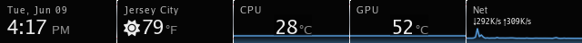
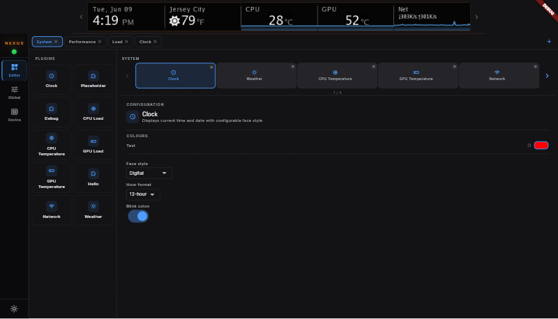

# Nexus Open

Open-source Linux controller for the Corsair iCUE Nexus companion display.


## Overview

Nexus Open is a native Linux application for the Corsair iCUE Nexus (640×48 pixel companion display). It streams live system metrics and custom content to the display, with a Flutter settings UI for configuration.

The device is not officially supported on Linux — this project reverse-engineered the USB protocol to make it work.





## Features

- **Live system monitoring** — CPU and GPU temperature, load, and network throughput
- **Weather display** — configurable location and units via open-meteo
- **Sparklines and graphs** — per-zone graph types (sparkline, bar, area, segmented, combo)
- **Multi-page layouts** — swipe between display pages with spring-physics transitions
- **Flutter settings UI** — dark-mode, live 640×48 hardware preview via WebSocket
- **Layout editor** — configure zones, plugins, and page order without restarting
- **REST API** — full HTTP API for programmatic control; OpenAPI 3.0 spec at `/openapi.yaml`
- **Plugin system** — write a plugin in Go, drop a binary, reference it in the layout YAML
- **Headless mode** — runs as a systemd user service with no tray or UI required

## Quick Start

### Prerequisites

- Go 1.25+
- Flutter 3.24+
- `libusb-1.0-dev`
- Corsair iCUE Nexus (USB VID `0x1b1c`, PID `0x1b8e`)

### Run from source

```bash
git clone https://github.com/mantonx/nexus-open.git
cd nexus-open

# Install dev tools (air, overmind, watchexec)
make setup

# One-time: set up USB permissions
sudo nexus-open --setup-udev   # or: sudo bash scripts/setup-udev.sh

# Start full dev environment (Go hot-reload + Flutter hot-reload)
make dev
```

`make dev` starts the Go backend (via air), the Flutter UI, and a Dart file watcher under overmind. Changes to `.go` files rebuild the daemon in ~3 s; changes to `.dart` files hot-reload the UI in under a second.

To develop without hardware:

```bash
NEXUS_MOCK_DEVICE=1 make dev
```

### Install from package

| Distribution | Command |
| --- | --- |
| Flatpak (all distros) | `flatpak install flathub com.github.nexusopen.NexusOpen` |
| Snap | `sudo snap install nexus-open` |
| Debian / Ubuntu | `sudo dpkg -i nexus-open_1.0.0_amd64.deb` |
| Arch Linux (AUR) | `yay -S nexus-open` |
| AppImage | `chmod +x nexus-open-1.0.0-x86_64.AppImage && ./nexus-open-1.0.0-x86_64.AppImage` |

See [docs/INSTALLATION.md](docs/INSTALLATION.md) for full instructions and USB permission setup.

## Build Commands

```bash
make build          # Development binary (with debug info)
make build-release  # Optimised release binary (stripped)
make build-ui       # Flutter UI only
make build-plugins  # All external plugins
make build-all      # Everything

make test           # Run all tests
make test-race      # Run with race detector
make coverage       # Coverage report

make dev            # Full hot-reload environment (Go + Flutter + watcher)
make dev-backend    # Go hot-reload only (air)
make dev-ui         # Flutter runner only

make install        # Build + install to ~/.local/bin, restart service
make doctor         # Check runtime health and dev toolchain

make deb            # DEB package
make appimage       # AppImage
make rpm            # RPM package
```

## Architecture

```text
┌─────────────────┐    WebSocket (frame stream)   ┌─────────────────┐
│   Flutter UI    │ ◄───────────────────────────── │   Go backend    │
│  (settings,     │                                │  + USB device   │
│   live preview) │ ──── REST API :1985 ──────────► │                 │
└─────────────────┘                                └────────┬────────┘
                                                            │ go-plugin (net/RPC)
                                               ┌────────────▼────────────┐
                                               │  Plugin subprocesses    │
                                               │  cpu-temp  gpu-temp     │
                                               │  cpu-load  gpu-load     │
                                               │  network   weather      │
                                               └─────────────────────────┘
```

The Flutter UI receives the hardware framebuffer as a live RGBA stream over WebSocket — there is no separate "preview render." Everything shown in the settings preview is the exact frame being sent to the device.

## Project Structure

```text
nexus-open/
├── cmd/nexus-open/         # Application entry point and CLI flags
├── internal/
│   ├── app/                # Dependency wiring and lifecycle
│   ├── api/                # REST API server and WebSocket hub
│   ├── device/             # USB HID abstraction (real + mock)
│   ├── zone/               # Layout, renderer, sampler, transitions
│   ├── plugins/            # Plugin host (go-plugin) and builtin plugins
│   ├── store/              # SQLite persistence (settings, layout, configs)
│   ├── settings/           # User settings manager
│   ├── touch/              # Touch event reader and handler
│   ├── tray/               # System tray integration
│   └── design/             # Hardware display design tokens (generated)
├── pkg/plugin/             # Public plugin interface (types, errors, protocol)
├── plugins/                # External plugin source
│   ├── cpu-temp/           # CPU temperature
│   ├── cpu-load/           # CPU load percentage
│   ├── gpu-temp/           # GPU temperature (AMD, Intel, NVIDIA)
│   ├── gpu-load/           # GPU load and VRAM
│   ├── network/            # Network throughput (↓/↑)
│   ├── weather/            # Weather via open-meteo
│   └── hello/              # Minimal example plugin
├── ui/                     # Flutter application
├── configs/layouts/        # Layout YAML files
├── design/                 # Style Dictionary token pipeline
├── packaging/              # DEB, RPM, AppImage, Flatpak, Snap, AUR
├── scripts/                # Build and setup scripts
├── docs/                   # Documentation
└── testdata/               # Golden frames and payload fixtures
```

## Writing a Plugin

Plugins are standalone Go binaries launched over net/RPC via [hashicorp/go-plugin](https://github.com/hashicorp/go-plugin). The interface is in `pkg/plugin/`:

```go
type Plugin interface {
    Describe() (Descriptor, error)
    Sample()   (Payload, error)
    Configure(cfg map[string]any) error
}
```

See `plugins/hello/main.go` for a minimal working example. Reference your plugin binary in a layout YAML under `configs/layouts/` using an `exec:` specifier.

## REST API

The backend listens on `127.0.0.1:1985`. Key endpoints:

| Endpoint | Description |
| --- | --- |
| `GET /api/health` | Health check and device status |
| `GET /api/config` | Get user settings |
| `POST /api/config` | Update user settings |
| `GET /api/layout` | Current layout (pages + zones) |
| `GET /api/plugins` | Plugin catalog with per-zone status |
| `GET /api/zones/{id}/status` | Zone health and last error |
| `GET /api/device/info` | Firmware version, connection state |
| `GET /api/ws` | WebSocket — streams live 640×48 RGBA frames |
| `GET /openapi.yaml` | OpenAPI 3.0 specification |

Full documentation at `/openapi.yaml` when the backend is running, or in `api/openapi.yaml`.

## Troubleshooting

**Device not found** — Run `lsusb | grep 1b1c`. If the device doesn't appear, try a different USB port. If it appears but the app can't open it, run `make doctor` to check USB permissions.

**USB permission denied** — Install udev rules and rejoin the `plugdev` group:

```bash
sudo nexus-open --setup-udev
sudo usermod -a -G plugdev $USER
# Log out and back in
```

See [DEVICE_SETUP.md](DEVICE_SETUP.md) for per-distro instructions.

**Port 1985 in use** — `ss -tlnp | grep 1985` to find the conflicting process, or run on a different port with `nexus-open --port 1986`.

**Plugin shows blank** — Check `GET /api/zones/{id}/status` for the error. Confirm the plugin binary is built (`make build-plugins`).

## Contributing

See [CONTRIBUTING.md](CONTRIBUTING.md) for the development workflow and [DEVELOPMENT.md](DEVELOPMENT.md) for environment setup.

## License

MIT — see [LICENSE](LICENSE).

---

*Not affiliated with Corsair. iCUE Nexus is a trademark of Corsair.*
